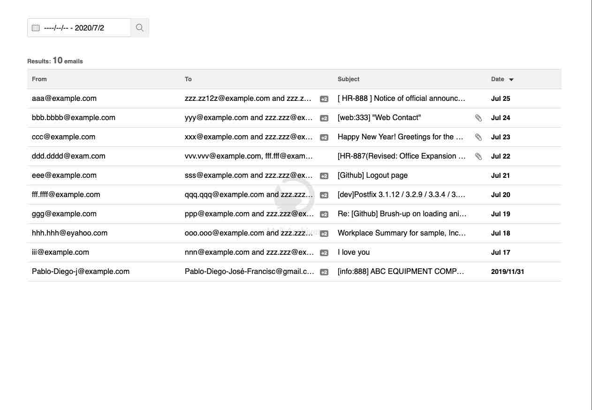
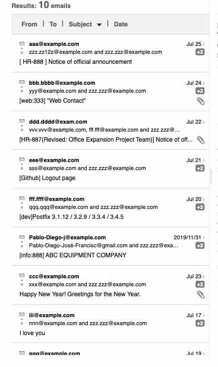
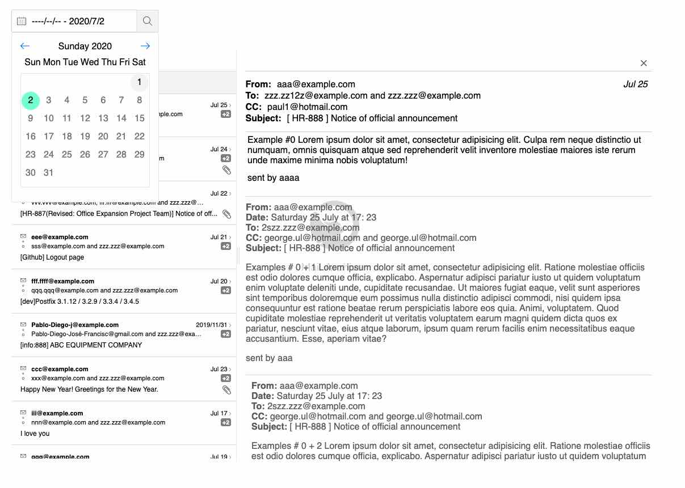
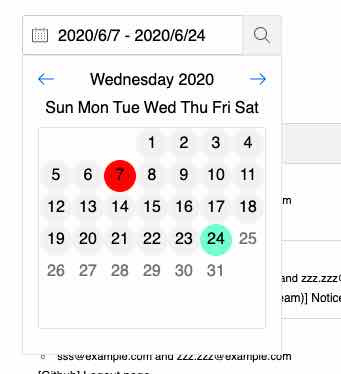
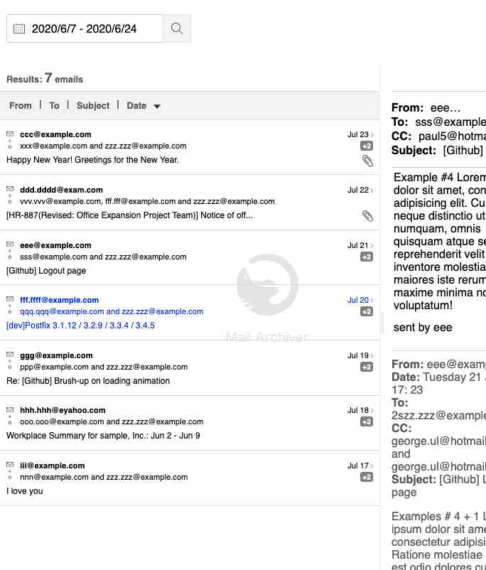
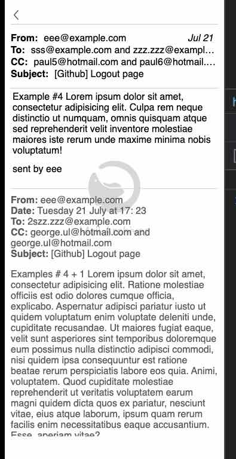
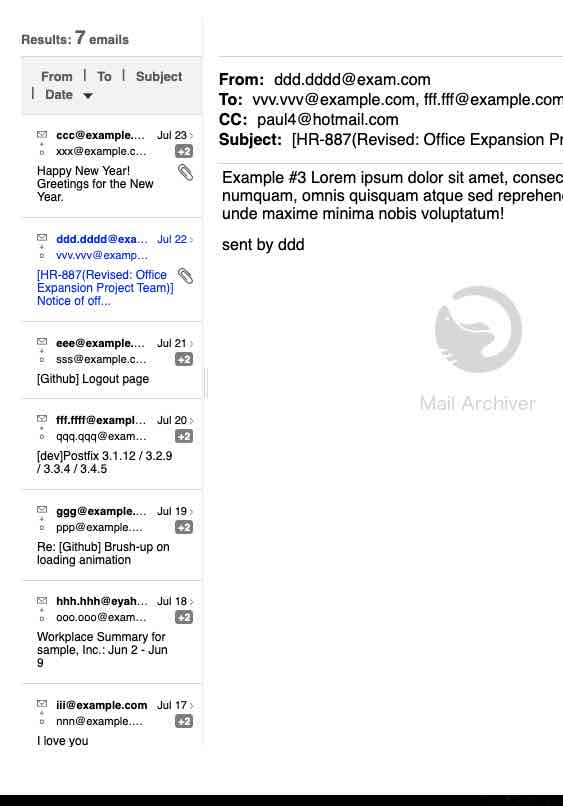

## Report

Here are some of the things that i got done and some screenshots.

  - I created which represents the view of desktop.
    

      
    

 
  - I added the ability to show e-mail details on the side, it works for tablet, mobile and desktop views.
 
  - When it is small form factor i'm using a list to display the list of e-mails .

    

      
    

  
  - I added and designed my owne date picker that works perfectly with vue.js
    

      
    

 
  - Added the posiblity to set different ranges.
  
  

      
  

  
  - I added the posibility to sort the list on with different factors (From, to, date and subject).
  

      
  

  - In small form factor i add the posibility to move from screen to screen using back button, in desktop added the close icon "X" to exit out the app.
  

      
  

  
  - The posibility to display different replies of an e-mail.
 
  - I addded panes that add the posibilty to resize both sides of the application (email display and list).
  

      
  

  
  

I didn't had the possibility to test IE support but i stil used css prefixes and put attention to cross browser compatibility.

